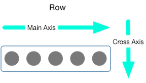

# Flutter

---

### 环境搭建

- android sdk
- xcode (macos)
- android studio
- vscode

note:

--

### 建议搭建顺序

1. 安装 android studio
2. 运行 android studio 初始化 android sdk
3. 安装 flutter sdk

--

### 安装SDK

将 flutter 仓库克隆到本地，并切换到 stable 分支

```bash
git clone -b stable https://github.com/flutter/flutter.git
```

--

### 配置环境变量

以 zsh 为例，将以下内容添加到 .zshrc 中

```bash
# flutter 包的国内源
export PUB_HOSTED_URL=https://pub.flutter-io.cn
export FLUTTER_STORAGE_BASE_URL=https://storage.flutter-io.cn

# 环境变量
export PATH="$PWD/.library/flutter/bin:$PATH"
```

--

### 运行环境检测

连接设备后，执行 `flutter doctor` 命令检查本机环境是否能正常

```bash
~ flutter doctor
Doctor summary (to see all details, run flutter doctor -v):
[✓] Flutter (Channel stable, v1.9.1+hotfix.6, on Linux, locale zh_CN.UTF-8)
 
[✓] Android toolchain - develop for Android devices (Android SDK version 29.0.2)
[✓] Android Studio (version 3.5)
[✓] VS Code (version 1.40.1)
[✓] Connected device (1 available)

• No issues found!
```

--

### 由于 android_SDK 导致 doctor 失败

在 .zshrc 中添加以下内容定义 androidSDK 路径，路径需根据本地实际环境配置

```bash
# android
export ANDROID_HOME="$PWD/.library/Android/sdk"
```

---

### 项目创建和运行

--

### 构建一个基本的 flutter 项目

执行如下命令

```bash
flutter create -t app <项目名称>
```

--

### 项目运行

进入项目目录，执行获取包命令

```bash
flutter pub get
```

生成项目，部署运行

```bash
flutter run
```

---

### 基础语法

- 变量定义
- 数据类型
- 集合
- 条件语句
- 函数表达式
- 枚举  
...

--

### 类

类的定义

```dart
class A {
  void a() { print("这是A的a方法"); }
}
```

类的继承

```dart
class Ason extends A {}
```

类的使用

```dart
var aInstance = new A() // var aInstance = A()
```

--

类的实现

```dart
// 可以多实现，但是必须重写方法
class Aimpl implements A {
  @override
  void a() { }
}
```

混合

```dart
// with 多个类，同时获得他们的所有方法和属性
class Amixin with A { }
```

--

### 构造函数


---

### 基本组件

MaterialApp  
Scaffold  
AppBar

---

### 布局组件

- Row
- Column
- Expanded
- Center
- Container
- GridView
- ListView  
  ...

--

### Row & Column




--

### MainAxisAlignment

```dart
enum MainAxisAlignment {
  //将子控件放在主轴的开始位置
  start,  
   //将子控件放在主轴的结束位置
  end,
  //将子控件放在主轴的中间位置
  center,
  //将主轴空白位置进行均分，排列子元素，手尾没有空隙
  spaceBetween,
  //将主轴空白区域均分，使中间各个子控件间距相等，首尾子控件间距为中间子控件间距的一半
  spaceAround,
  //将主轴空白区域均分，使各个子控件间距相等
  spaceEvenly,
}
```

--

### CrossAxisAlignment

```dart
enum CrossAxisAlignment {
  //将子控件放在交叉轴的起始位置
  start,
  //将子控件放在交叉轴的结束位置
  end,
  //将子控件放在交叉轴的中间位置
  center,
  //使子控件填满交叉轴
  stretch,
  //将子控件放在交叉轴的上，并且与基线相匹配（不常用）
  baseline,
}
```

--

### baseline

用于两个字号不一样的文字，底部在一条水平线上


---

### 状态管理

- StatelessWidget
- StatefulWidget
- Redux

---

### 项目调试

--

### vscode

用 vscode 打开项目，创建调试定义

> 提示：vscode 需要安装 flutter 扩展以便进行调试

--

### dev tools

